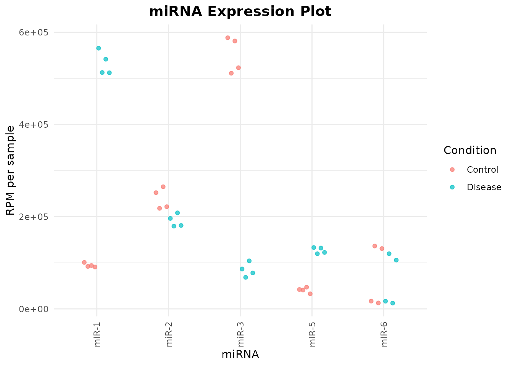
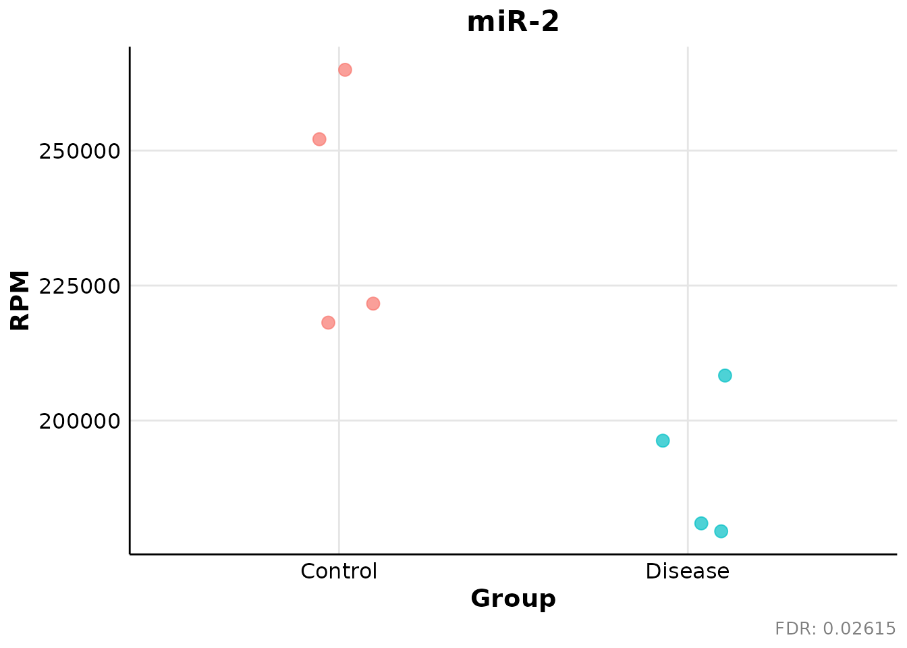

# miRPM Workflow

## Overview

`miRPM` provides a transparent workflow for exploratory analysis of
miRNA-seq count matrices using reads per million (RPM) normalization.

The workflow includes:

1.  RPM normalization.
2.  Abundance and prevalence filtering.
3.  Nonparametric group comparisons.
4.  Static and interactive expression plots.

RPM is an abundance-scaling method. It does not replace count-based
differential-expression models such as DESeq2, edgeR, or limma-voom when
modelling complex experimental designs, composition bias, or
count-dependent variance is required.

## Load the package and example data

``` r

library(miRPM)

data("miRPM_example", package = "miRPM")

counts <- miRPM_example$counts
metadata <- miRPM_example$metadata
```

The example dataset is synthetic and is intended only for documentation
and testing.

``` r

dim(counts)
#> [1] 6 8
head(counts)
#>        S1  S2  S3  S4  S5  S6  S7  S8
#> miR-1 120 135 110 125 850 900 780 920
#> miR-2 300 320 310 305 295 315 300 325
#> miR-3 700 750 680 720 130 120 150 140
#> miR-4   0   2   0   1   3   0   2   1
#> miR-5  50  60  55  45 200 210 190 220
#> miR-6  20 200  15 180  25 210  18 190
metadata
#>   Sample Condition
#> 1     S1   Control
#> 2     S2   Control
#> 3     S3   Control
#> 4     S4   Control
#> 5     S5   Disease
#> 6     S6   Disease
#> 7     S7   Disease
#> 8     S8   Disease
```

The count matrix must contain miRNAs in rows and samples in columns.

``` r

stopifnot(
  identical(colnames(counts), metadata$Sample),
  all(counts >= 0),
  all(is.finite(counts))
)
```

## Normalize counts to RPM

By default,
[`normalize_rpm()`](https://sergio30po.github.io/miRPM/reference/normalize_rpm.md)
calculates each library size from the complete column sum of the input
count matrix.

``` r

rpm <- normalize_rpm(counts)

dim(rpm)
#> [1] 6 8
round(rpm[, 1:4], 2)
#>              S1        S2        S3        S4
#> miR-1 100840.34  92024.54  94017.09  90843.02
#> miR-2 252100.84 218132.24 264957.26 221656.98
#> miR-3 588235.29 511247.44 581196.58 523255.81
#> miR-4      0.00   1363.33      0.00    726.74
#> miR-5  42016.81  40899.80  47008.55  32703.49
#> miR-6  16806.72 136332.65  12820.51 130813.95
```

The returned matrix contains normalization metadata.

``` r

attr(rpm, "miRPM_normalization")
#> $method
#> [1] "RPM"
#> 
#> $scale
#> [1] 1e+06
#> 
#> $library_sizes
#>   S1   S2   S3   S4   S5   S6   S7   S8 
#> 1190 1467 1170 1376 1503 1755 1440 1796 
#> 
#> $reads_per_rpm
#>       S1       S2       S3       S4       S5       S6       S7       S8 
#> 0.001190 0.001467 0.001170 0.001376 0.001503 0.001755 0.001440 0.001796 
#> 
#> $library_size_source
#> [1] "matrix_column_sums"
#> 
#> $input_features
#> [1] 6
#> 
#> $input_samples
#> [1] 8
```

Externally calculated library sizes can also be supplied as a named
vector.

``` r

library_sizes <- setNames(
  c(
    2.1e6, 2.3e6, 2.0e6, 2.2e6,
    1.9e6, 2.4e6, 2.1e6, 2.0e6
  ),
  colnames(counts)
)

rpm_external <- normalize_rpm(
  count_matrix = counts,
  library_sizes = library_sizes
)

dim(rpm_external)
#> [1] 6 8
```

## Filter low-information miRNAs

Filtering can combine:

- Minimum RPM abundance.
- Minimum raw count.
- Minimum prevalence.
- Minimum number of qualifying samples.
- Group-specific prevalence requirements.

The following example retains miRNAs satisfying the criteria in at least
one experimental group.

``` r

filtered <- filter_mirnas(
  rpm_matrix = rpm,
  metadata = metadata,
  raw_counts = counts,
  min_rpm = 5,
  min_count = 10,
  min_prevalence = 0.5,
  min_samples = 2,
  group_column = "Condition",
  prevalence_scope = "any_group",
  return_diagnostics = TRUE
)

filtered$summary
#> $input_mirnas
#> [1] 6
#> 
#> $retained_mirnas
#> [1] 5
#> 
#> $removed_mirnas
#> [1] 1
#> 
#> $retained_fraction
#> [1] 0.8333333
#> 
#> $min_rpm
#> [1] 5
#> 
#> $min_count
#> [1] 10
#> 
#> $min_prevalence
#> [1] 0.5
#> 
#> $min_samples
#> [1] 2
#> 
#> $prevalence_scope
#> [1] "any_group"
#> 
#> $min_groups
#> [1] 1
#> 
#> $number_of_groups
#> [1] 2
#> 
#> $count_requirement_source
#> [1] "raw_counts"
#> 
#> $rpm_threshold_read_equivalents
#>       S1       S2       S3       S4       S5       S6       S7       S8 
#> 0.005950 0.007335 0.005850 0.006880 0.007515 0.008775 0.007200 0.008980 
#> 
#> $legacy_interface
#> [1] FALSE
```

The filtered RPM matrix is available in `filtered$filtered_matrix`.

``` r

rownames(filtered$filtered_matrix)
#> [1] "miR-1" "miR-2" "miR-3" "miR-5" "miR-6"
dim(filtered$filtered_matrix)
#> [1] 5 8
```

Detailed filtering information is available for each miRNA.

``` r

filtered$diagnostics
#>   miRNA    mean_rpm  median_rpm maximum_rpm overall_detected_samples
#> 1 miR-1 313749.6514 306544.8897  565535.595                        8
#> 2 miR-2 215237.4550 213232.7880  264957.265                        8
#> 3 miR-3 317615.3187 307707.0552  588235.294                        8
#> 4 miR-4    753.9701    641.7685    1996.008                        0
#> 5 miR-5  83724.1041  83333.3333  133067.199                        8
#> 6 miR-6  68919.5008  61298.6843  136332.652                        8
#>   overall_prevalence groups_passing passes_filter
#> 1                  1              2          TRUE
#> 2                  1              2          TRUE
#> 3                  1              2          TRUE
#> 4                  0              0         FALSE
#> 5                  1              2          TRUE
#> 6                  1              2          TRUE
#>                                      reason group_size_Control
#> 1                                  retained                  4
#> 2                                  retained                  4
#> 3                                  retained                  4
#> 4 below_abundance_or_prevalence_requirement                  4
#> 5                                  retained                  4
#> 6                                  retained                  4
#>   required_samples_Control detected_samples_Control prevalence_Control
#> 1                        2                        4                  1
#> 2                        2                        4                  1
#> 3                        2                        4                  1
#> 4                        2                        0                  0
#> 5                        2                        4                  1
#> 6                        2                        4                  1
#>   passes_Control group_size_Disease required_samples_Disease
#> 1           TRUE                  4                        2
#> 2           TRUE                  4                        2
#> 3           TRUE                  4                        2
#> 4          FALSE                  4                        2
#> 5           TRUE                  4                        2
#> 6           TRUE                  4                        2
#>   detected_samples_Disease prevalence_Disease passes_Disease
#> 1                        4                  1           TRUE
#> 2                        4                  1           TRUE
#> 3                        4                  1           TRUE
#> 4                        0                  0          FALSE
#> 5                        4                  1           TRUE
#> 6                        4                  1           TRUE
```

Filtering thresholds should be chosen according to sequencing depth,
sample size, biological context, and the intended downstream analysis.
They should not be interpreted as universal detection thresholds.

## Perform nonparametric group comparisons

[`perform_statistical_tests()`](https://sergio30po.github.io/miRPM/reference/perform_statistical_tests.md)
analyzes the filtered RPM matrix using nonparametric methods.

For two independent groups, the function performs a Wilcoxon rank-sum
test. For more than two groups, it performs a Kruskal-Wallis test and
can calculate Dunn post-hoc comparisons.

``` r

de_result <- perform_statistical_tests(
  miRNA_ftd = filtered$filtered_matrix,
  metadata = metadata,
  condition = "Condition",
  group_order = c("Control", "Disease"),
  output_file = NULL,
  assign_results = FALSE,
  write_excel = FALSE
)
```

The complete result table includes raw and adjusted p-values together
with descriptive and effect-size information.

``` r

de_result$results
#>   miRNA group_1 group_2 wilcox_statistic mann_whitney_u_group_1    p_value
#> 1 miR-2 Control Disease               16                     16 0.02092134
#> 2 miR-3 Control Disease               16                     16 0.02092134
#> 3 miR-1 Control Disease                0                      0 0.02092134
#> 4 miR-5 Control Disease                0                      0 0.02092134
#> 5 miR-6 Control Disease               11                     11 0.38647623
#>   rank_biserial_group_1_vs_group_2 probability_group_1_greater_group_2
#> 1                            1.000                              1.0000
#> 2                            1.000                              1.0000
#> 3                           -1.000                              0.0000
#> 4                           -1.000                              0.0000
#> 5                            0.375                              0.6875
#>   median_difference_group_1_minus_group_2 mean_difference_group_1_minus_group_2
#> 1                                48263.01                              47948.75
#> 2                               470003.86                             466736.93
#> 3                              -434222.77                            -438636.81
#> 4                               -85761.14                             -86133.89
#> 5                                12598.32                              10547.92
#>   log2_median_ratio_group_1_vs_group_2        FDR p_significance
#> 1                            0.3286969 0.02615167              *
#> 2                            2.7476420 0.02615167              *
#> 3                           -2.5028314 0.02615167              *
#> 4                           -1.6175628 0.02615167              *
#> 5                            0.2700038 0.38647623               
#>   FDR_significance overall_mean overall_median overall_iqr overall_mad
#> 1                *     215237.5      213232.79    36822.93    36497.00
#> 2                *     317615.3      307707.06   453383.00   334303.64
#> 3                *     313749.7      306544.89   426513.10   316570.79
#> 4                *      83724.1       83333.33    83119.38    62083.92
#> 5                       68919.5       61298.68   106766.90    72111.33
#>   overall_minimum overall_maximum overall_detected_samples overall_prevalence
#> 1       179487.18        264957.3                        8                  1
#> 2        68376.07        588235.3                        8                  1
#> 3        90843.02        565535.6                        8                  1
#> 4        32703.49        133067.2                        8                  1
#> 5        12500.00        136332.7                        8                  1
#>   overall_zero_fraction n_Control mean_Control median_Control iqr_Control
#> 1                     0         4    239211.83      236878.91   34539.153
#> 2                     0         4    550983.78      552226.20   62702.538
#> 3                     0         4     94431.25       93020.82    3993.744
#> 4                     0         4     40657.16       41458.30    4414.023
#> 5                     0         4     74193.46       73810.34  116383.458
#>   mad_Control minimum_Control maximum_Control detected_samples_Control
#> 1   25180.921       218132.24       264957.26                        4
#> 2   48169.289       511247.44       588235.29                        4
#> 3    2352.939        90843.02       100840.34                        4
#> 4    4528.417        32703.49        47008.55                        4
#> 5   87468.538        12820.51       136332.65                        4
#>   prevalence_Control zero_fraction_Control n_Disease mean_Disease
#> 1                  1                     0         4    191263.08
#> 2                  1                     0         4     84246.85
#> 3                  1                     0         4    533068.05
#> 4                  1                     0         4    126791.05
#> 5                  1                     0         4     63645.54
#>   median_Disease iqr_Disease mad_Disease minimum_Disease maximum_Disease
#> 1      188615.90    18698.86   12444.158       179487.18        208333.3
#> 2       82222.34    15354.66   13430.585        68376.07        104166.7
#> 3      527243.59    34956.15   21806.988       512249.44        565535.6
#> 4      127219.44    10439.78    7837.592       119658.12        133067.2
#> 5       61212.02    93657.46   69156.356        12500.00        119658.1
#>   detected_samples_Disease prevalence_Disease zero_fraction_Disease
#> 1                        4                  1                     0
#> 2                        4                  1                     0
#> 3                        4                  1                     0
#> 4                        4                  1                     0
#> 5                        4                  1                     0
```

Results passing the selected significance threshold are stored
separately.

``` r

de_result$significant_results
#>   miRNA group_1 group_2 wilcox_statistic mann_whitney_u_group_1    p_value
#> 1 miR-2 Control Disease               16                     16 0.02092134
#> 2 miR-3 Control Disease               16                     16 0.02092134
#> 3 miR-1 Control Disease                0                      0 0.02092134
#> 4 miR-5 Control Disease                0                      0 0.02092134
#>   rank_biserial_group_1_vs_group_2 probability_group_1_greater_group_2
#> 1                                1                                   1
#> 2                                1                                   1
#> 3                               -1                                   0
#> 4                               -1                                   0
#>   median_difference_group_1_minus_group_2 mean_difference_group_1_minus_group_2
#> 1                                48263.01                              47948.75
#> 2                               470003.86                             466736.93
#> 3                              -434222.77                            -438636.81
#> 4                               -85761.14                             -86133.89
#>   log2_median_ratio_group_1_vs_group_2        FDR p_significance
#> 1                            0.3286969 0.02615167              *
#> 2                            2.7476420 0.02615167              *
#> 3                           -2.5028314 0.02615167              *
#> 4                           -1.6175628 0.02615167              *
#>   FDR_significance overall_mean overall_median overall_iqr overall_mad
#> 1                *     215237.5      213232.79    36822.93    36497.00
#> 2                *     317615.3      307707.06   453383.00   334303.64
#> 3                *     313749.7      306544.89   426513.10   316570.79
#> 4                *      83724.1       83333.33    83119.38    62083.92
#>   overall_minimum overall_maximum overall_detected_samples overall_prevalence
#> 1       179487.18        264957.3                        8                  1
#> 2        68376.07        588235.3                        8                  1
#> 3        90843.02        565535.6                        8                  1
#> 4        32703.49        133067.2                        8                  1
#>   overall_zero_fraction n_Control mean_Control median_Control iqr_Control
#> 1                     0         4    239211.83      236878.91   34539.153
#> 2                     0         4    550983.78      552226.20   62702.538
#> 3                     0         4     94431.25       93020.82    3993.744
#> 4                     0         4     40657.16       41458.30    4414.023
#>   mad_Control minimum_Control maximum_Control detected_samples_Control
#> 1   25180.921       218132.24       264957.26                        4
#> 2   48169.289       511247.44       588235.29                        4
#> 3    2352.939        90843.02       100840.34                        4
#> 4    4528.417        32703.49        47008.55                        4
#>   prevalence_Control zero_fraction_Control n_Disease mean_Disease
#> 1                  1                     0         4    191263.08
#> 2                  1                     0         4     84246.85
#> 3                  1                     0         4    533068.05
#> 4                  1                     0         4    126791.05
#>   median_Disease iqr_Disease mad_Disease minimum_Disease maximum_Disease
#> 1      188615.90    18698.86   12444.158       179487.18        208333.3
#> 2       82222.34    15354.66   13430.585        68376.07        104166.7
#> 3      527243.59    34956.15   21806.988       512249.44        565535.6
#> 4      127219.44    10439.78    7837.592       119658.12        133067.2
#>   detected_samples_Disease prevalence_Disease zero_fraction_Disease
#> 1                        4                  1                     0
#> 2                        4                  1                     0
#> 3                        4                  1                     0
#> 4                        4                  1                     0
```

Adjusted p-values control the false discovery rate across the tested
miRNAs. Statistical significance should be interpreted together with
effect size, abundance, prevalence, consistency, and study design.

## Create a joint expression plot

[`miRNA_expression_plot()`](https://sergio30po.github.io/miRPM/reference/miRNA_expression_plot.md)
returns both a static `ggplot2` object and an interactive `plotly`
object.

``` r

joint_plot <- miRNA_expression_plot(
  mirnas = rownames(filtered$filtered_matrix),
  rpm_matrix = filtered$filtered_matrix,
  metadata = metadata,
  condition_column = "Condition",
  sample_column = "Sample",
  groups = c("Control", "Disease"),
  save_html = FALSE
)

joint_plot$ggplot
```



The interactive object is available as:

``` r

class(joint_plot$interactive)
#> [1] "plotly"     "htmlwidget"
```

It can be displayed interactively in an RStudio viewer, R Markdown
document, or compatible HTML environment.

## Create individual miRNA plots

[`individual_miRNA_plot()`](https://sergio30po.github.io/miRPM/reference/individual_miRNA_plot.md)
creates one static plot for each selected miRNA.

``` r

individual_plots <- individual_miRNA_plot(
  filtered_results = de_result$results,
  rpm_matrix = filtered$filtered_matrix,
  metadata = metadata,
  condition_column = "Condition",
  sample_column = "Sample",
  groups_to_include = c("Control", "Disease"),
  adjusted_pvalue_column = "FDR",
  save_png = FALSE
)

length(individual_plots$plots)
#> [1] 5
```

Display the first plot:

``` r

individual_plots$plots[[1]]
```



The returned object also reports selected miRNAs, missing miRNAs,
adjusted p-values, data used for plotting, and any files written to
disk.

``` r

names(individual_plots)
#> [1] "plots"            "files"            "data"             "selected_mirnas" 
#> [5] "missing_mirnas"   "groups"           "adjusted_pvalues" "output_folder"
individual_plots$adjusted_pvalues
#>      miR-2      miR-3      miR-1      miR-5      miR-6 
#> 0.02615167 0.02615167 0.02615167 0.02615167 0.38647623
```

## Reproducible workflow summary

A typical `miRPM` analysis follows this order:

``` r

rpm <- normalize_rpm(counts)

filtered <- filter_mirnas(
  rpm_matrix = rpm,
  metadata = metadata,
  raw_counts = counts,
  group_column = "Condition",
  prevalence_scope = "any_group",
  return_diagnostics = TRUE
)

results <- perform_statistical_tests(
  miRNA_ftd = filtered$filtered_matrix,
  metadata = metadata,
  condition = "Condition",
  assign_results = FALSE,
  write_excel = FALSE
)
```

Normalization should be performed before filtering so that library sizes
are calculated from the complete count matrix unless valid external
library sizes are supplied.
